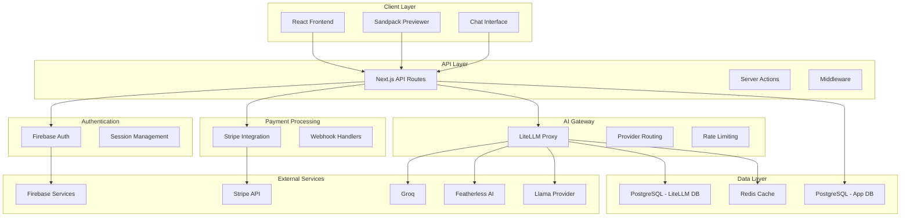
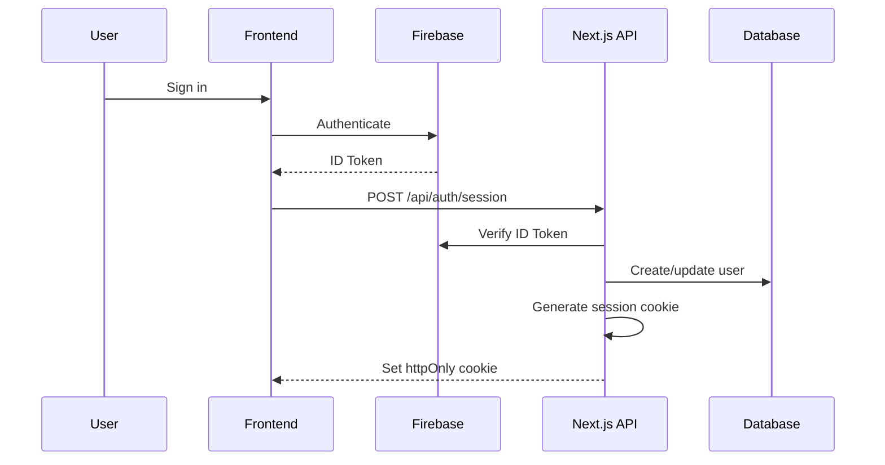
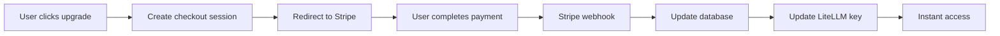
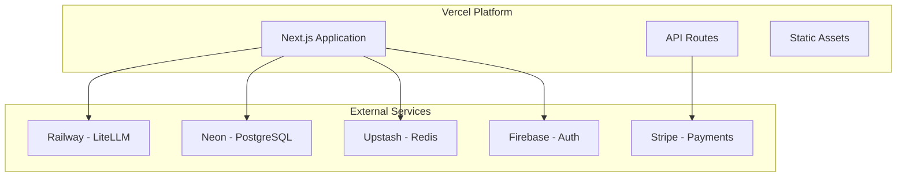

# Tesslate Studio Lite - System Architecture

## Overview

Tesslate Studio Lite is a sophisticated AI-powered platform built with modern web technologies, featuring real-time chat capabilities, interactive code generation, comprehensive subscription management, and a multi-provider LLM gateway. The architecture follows microservices principles with clear separation of concerns and scalable design patterns.

## High-Level Architecture



## Core Technologies

### Frontend Stack
- **Next.js 15** (App Router) - React framework with SSR/SSG
- **React 18** - UI library with concurrent features
- **TypeScript** - Type-safe development
- **Tailwind CSS** - Utility-first styling
- **Shadcn/UI** - Component library
- **Radix UI** - Accessible primitives
- **Sandpack** - In-browser code editing and preview

### Backend Stack
- **Next.js API Routes** - Serverless API endpoints
- **Drizzle ORM** - Type-safe database operations
- **PostgreSQL** - Primary database
- **Redis** - Caching and session storage
- **Firebase Admin SDK** - Authentication
- **LiteLLM** - AI model gateway

### Infrastructure
- **Docker** - Containerization
- **Docker Compose** - Local development orchestration
- **Vercel** (recommended) - Production deployment
- **GitHub Actions** - CI/CD pipeline

## System Components

### 1. Frontend Architecture

#### Component Structure
```
/components
├── ui/                    # Base UI components (shadcn/ui)
├── chat/                  # Chat-specific components
│   ├── chat.tsx          # Main chat container
│   ├── chat-input.tsx    # Message input component
│   ├── chat-sidebar.tsx  # Chat history sidebar
│   └── SandpackPreviewer.tsx # Code preview component
├── layout/               # Layout components
├── auth/                 # Authentication components
└── payments/             # Payment-related components
```

#### State Management
- **React State** - Local component state
- **SWR** - Data fetching and caching
- **Context API** - Global state (dark mode, user)
- **Custom Hooks** - Reusable stateful logic

#### Key Features
- **Real-time Streaming** - WebSocket-like streaming for AI responses
- **Optimistic Updates** - Immediate UI updates before server confirmation
- **Infinite Scroll** - Efficient rendering of large chat histories
- **Code Highlighting** - Syntax highlighting for multiple languages
- **Responsive Design** - Mobile-first approach

### 2. API Layer Architecture

#### Route Structure
```
/app/api
├── auth/
│   └── session/          # Firebase session management
├── chat/
│   ├── history/          # Chat persistence
│   └── guest-count/      # Guest usage tracking
├── proxy/
│   └── chat/             # LiteLLM proxy endpoint
├── stripe/
│   ├── checkout/         # Payment completion
│   ├── webhook/          # Stripe webhooks
│   └── user/             # User subscription data
├── models/               # Available model list
└── user/                 # User management
```

#### Middleware Stack
```typescript
// /middleware.ts
export function middleware(request: NextRequest) {
  // 1. CORS handling
  // 2. Authentication verification
  // 3. Rate limiting
  // 4. Request logging
  // 5. Security headers
}
```

#### Server Actions
```typescript
// /lib/payments/actions.ts
export async function checkoutAction(formData: FormData) // Stripe checkout
export async function customerPortalAction()           // Customer portal
export async function cancelSignupAction()             // Cancel signup
```

### 3. Authentication System

#### Firebase Integration


#### Session Management
- **Server-side sessions** using httpOnly cookies
- **Middleware protection** for authenticated routes
- **Guest mode** for anonymous users
- **Automatic session refresh**

### 4. Database Architecture

#### App Database Schema
```sql
-- Core user management
users (
  id VARCHAR(255) PRIMARY KEY,           -- Firebase UID
  email VARCHAR(255) UNIQUE NOT NULL,
  display_name VARCHAR(255),
  photo_url TEXT,
  is_guest BOOLEAN DEFAULT false,
  litellm_virtual_key TEXT,             -- LiteLLM API key
  guest_message_count INTEGER DEFAULT 0,
  created_at TIMESTAMP DEFAULT NOW()
);

-- Subscription management
stripe (
  id SERIAL PRIMARY KEY,
  user_id VARCHAR(255) REFERENCES users(id),
  stripe_customer_id TEXT UNIQUE,
  stripe_subscription_id TEXT UNIQUE,
  stripe_product_id TEXT,
  plan_name VARCHAR(10) DEFAULT 'free',
  subscription_status VARCHAR(20) DEFAULT 'inactive',
  created_at TIMESTAMP DEFAULT NOW(),
  updated_at TIMESTAMP DEFAULT NOW()
);

-- Chat session tracking
chat_sessions (
  id UUID PRIMARY KEY DEFAULT uuid_generate_v4(),
  user_id VARCHAR(255) REFERENCES users(id),
  title VARCHAR(100) NOT NULL,
  selected_model_id VARCHAR(50),
  created_at TIMESTAMP DEFAULT NOW(),
  updated_at TIMESTAMP DEFAULT NOW()
);

-- Message storage
chat_messages (
  id UUID PRIMARY KEY DEFAULT uuid_generate_v4(),
  session_id UUID REFERENCES chat_sessions(id) ON DELETE CASCADE,
  role VARCHAR(10) NOT NULL,            -- 'user' | 'assistant'
  content JSONB NOT NULL,               -- Structured message content
  created_at TIMESTAMP DEFAULT NOW()
);

-- Activity logging
activity_logs (
  id SERIAL PRIMARY KEY,
  user_id VARCHAR(255) REFERENCES users(id),
  activity_type VARCHAR(50) NOT NULL,
  description TEXT,
  created_at TIMESTAMP DEFAULT NOW()
);
```

#### LiteLLM Database
- **Usage tracking** - Request logs, token usage
- **Key management** - Virtual key storage and metadata
- **Spend tracking** - Cost analysis per user/organization
- **Rate limiting** - Request counting and throttling

### 5. AI Integration Architecture

#### Model Provider Integration
```typescript
// /litellm.config.yaml
model_list:
  - model_name: "tesslate-uigen-v1"
    litellm_params:
      model: "featherless/tesslate/uigen-v1"
      api_base: "https://api.featherless.ai/v1"
      api_key: "os.environ/FEATHERLESS_API_KEY"
    model_info:
      access_groups: ["pro"]
      
  - model_name: "groq-llama-3.1-70b"
    litellm_params:
      model: "groq/llama-3.1-70b-versatile"
      api_key: "os.environ/GROQ_API_KEY"
    model_info:
      access_groups: ["plus"]
```

#### Request Flow
1. **User sends message** → Frontend chat component
2. **Authentication check** → Verify user session
3. **System prompt injection** → Add context prompts
4. **LiteLLM routing** → Route to appropriate model
5. **Stream processing** → Real-time response streaming
6. **Code detection** → Identify and process code blocks
7. **Artifact generation** → Create interactive previews

### 6. Payment System Architecture

#### Stripe Integration Flow


#### Subscription Management
- **Plan-based access control** - Model access by subscription tier
- **Real-time updates** - Immediate activation via webhooks
- **Customer portal** - Self-service subscription management
- **Usage tracking** - Monitor API usage per plan

### 7. Code Generation & Preview System

#### Sandpack Integration
```typescript
// Dynamic code detection and streaming
export function extractStreamingCodeBlocks(content: string): {
  codeBlocks: CodeBlock[];
  hasStreamingBlock: boolean;
} {
  // Parse markdown for code blocks
  // Detect language and filename
  // Stream to Sandpack preview
}
```

#### Preview Generation
- **Multi-file support** - HTML, CSS, JavaScript, React
- **Live updates** - Real-time code streaming
- **Template detection** - Automatic framework detection
- **Error handling** - Graceful fallback for invalid code

## Security Architecture

### Authentication Security
- **Firebase Admin SDK** server-side verification
- **httpOnly session cookies** prevent XSS attacks
- **CSRF protection** via SameSite cookie attributes
- **Session rotation** on authentication events

### API Security
- **Route protection** via middleware
- **Rate limiting** per user and endpoint
- **Input validation** using Zod schemas
- **SQL injection prevention** via parameterized queries

### Payment Security
- **Webhook signature verification**
- **PCI compliance** via Stripe integration
- **Server-side payment processing**
- **Secure customer data handling**

### Data Security
- **Encrypted database connections**
- **Environment variable protection**
- **API key rotation policies**
- **Audit logging** for sensitive operations

## Deployment Architecture

### Development Environment
```bash
# Local development with Docker
docker-compose up --build

# Services running:
# - Next.js app (localhost:3001)
# - LiteLLM proxy (localhost:4000)
# - PostgreSQL x2 (ports 54322, 54323)
# - Redis (localhost:6379)
```

### Production Deployment


### Scaling Considerations
- **Serverless API routes** auto-scale with demand
- **Database connection pooling** for concurrent requests
- **Redis caching** reduces database load
- **CDN distribution** for global performance
- **Load balancing** across LiteLLM instances

## Performance Optimizations

### Frontend Performance
- **Code splitting** - Route-based chunks
- **Image optimization** - Next.js automatic optimization
- **Lazy loading** - Components and routes
- **Memoization** - React.memo and useMemo
- **Virtual scrolling** - Large chat histories

### Backend Performance
- **Database indexing** - Optimized queries
- **Connection pooling** - Efficient DB connections
- **Caching strategies** - Redis for frequent data
- **Streaming responses** - Reduce time to first byte
- **Batch operations** - Multiple DB operations

### AI Performance
- **Model routing** - Latency-based selection
- **Request batching** - Combine similar requests
- **Response caching** - Cache common responses
- **Timeout handling** - Prevent hanging requests

## Monitoring & Observability

### Application Monitoring
- **Error tracking** - Console logging and error boundaries
- **Performance metrics** - API response times
- **User analytics** - Feature usage tracking
- **Health checks** - Service availability monitoring

### Infrastructure Monitoring
- **Database performance** - Query execution times
- **API gateway metrics** - Request rates and errors
- **Memory usage** - Container resource utilization
- **Network latency** - Inter-service communication

### Business Metrics
- **User engagement** - Chat frequency and duration
- **Subscription metrics** - Conversion and churn rates
- **Usage patterns** - Model preferences and code generation
- **Revenue tracking** - Subscription and usage-based billing

## Development Workflow

### Local Development
```bash
# Setup
git clone [repository]
pnpm install
cp .env.example .env
docker-compose up --build
pnpm db:migrate

# Development
pnpm dev          # Start development server
pnpm db:studio    # Database management UI
pnpm build        # Production build
pnpm test         # Run test suite
```

### Code Quality
- **TypeScript** - Type safety
- **ESLint** - Code linting
- **Prettier** - Code formatting
- **Husky** - Git hooks
- **Conventional commits** - Structured commit messages

### Testing Strategy
- **Unit tests** - Component and utility testing
- **Integration tests** - API endpoint testing
- **E2E tests** - User workflow testing
- **Performance tests** - Load and stress testing

## Future Architecture Considerations

### Scalability Improvements
- **Microservices migration** - Service decomposition
- **Event-driven architecture** - Async communication
- **Message queues** - Background job processing
- **Auto-scaling** - Dynamic resource allocation

### Feature Extensions
- **Multi-tenancy** - Organization support
- **Advanced analytics** - Usage dashboards
- **API marketplace** - Third-party integrations
- **Mobile applications** - React Native or PWA

### Infrastructure Evolution
- **Kubernetes deployment** - Container orchestration
- **Multi-region deployment** - Global availability
- **Advanced monitoring** - Prometheus and Grafana
- **Disaster recovery** - Backup and failover strategies

This architecture provides a solid foundation for a modern AI-powered SaaS platform with room for growth and evolution as requirements change and scale increases.