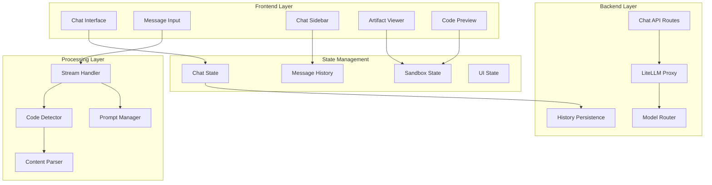

# Chat System Architecture

## Overview

The chat system is the core feature of Tesslate Studio Lite, providing real-time conversations with AI models, intelligent code generation, live previews, and sophisticated message management. Built with streaming technology and optimistic updates, it delivers a seamless user experience with advanced features like inline editing, artifact management, and multi-chat support.

## Architecture Overview



## Core Components

### 1. Chat Interface (`/components/chat/chat.tsx`)

The main chat component handles message display, streaming, and user interactions.

#### Key Features
- **Message Rendering** - Support for text, code, and artifacts
- **Streaming Display** - Real-time message updates
- **Inline Editing** - Edit and regenerate messages
- **Message Actions** - Retry, edit, copy functionality
- **Optimistic Updates** - Immediate UI feedback

#### Component Structure
```typescript
interface ChatProps {
  messages: Message[];
  isLoading: boolean;
  onOpenArtifact: (messageId: string) => void;
  onEdit: (messageId: string, newText: string) => void;
  onRetry: () => void;
  lastUserMessageId?: string;
  lastAssistantMessageId?: string;
}

const Chat = memo(function Chat({
  messages,
  isLoading,
  onOpenArtifact,
  onEdit,
  onRetry,
  lastUserMessageId,
  lastAssistantMessageId,
}: ChatProps) {
  // Implementation details
});
```

#### Message Types
```typescript
interface Message {
  id: string;
  role: 'user' | 'assistant';
  content: MessageContent[];
  stepsMarkdown?: string;     // Thinking/reasoning steps
  object?: ArtifactObject;    // Code artifacts
}

interface MessageContent {
  type: 'text';
  text: string;
}

interface ArtifactObject {
  title: string;
  codeBlocks: CodeBlock[];
}
```

### 2. Chat Input (`/components/chat/chat-input.tsx`)

Handles user message input with advanced features and validation.

#### Features
- **Multiline Support** - Auto-expanding textarea
- **Guest Limits** - Message count enforcement
- **Loading States** - Visual feedback during processing
- **Keyboard Shortcuts** - Submit on Enter, new line on Shift+Enter
- **Character Limits** - Prevent oversized messages

#### Implementation
```typescript
interface ChatInputProps {
  onSubmit: (message: string) => void;
  isLoading: boolean;
  disabled?: boolean;
  placeholder?: string;
}

export function ChatInput({ onSubmit, isLoading, disabled, placeholder }: ChatInputProps) {
  const [input, setInput] = useState('');
  const textareaRef = useRef<HTMLTextAreaElement>(null);
  
  const handleSubmit = (e: FormEvent) => {
    e.preventDefault();
    if (input.trim() && !isLoading) {
      onSubmit(input);
      setInput('');
    }
  };
  
  // Auto-resize functionality
  useEffect(() => {
    if (textareaRef.current) {
      textareaRef.current.style.height = 'auto';
      textareaRef.current.style.height = `${textareaRef.current.scrollHeight}px`;
    }
  }, [input]);
  
  return (
    <form onSubmit={handleSubmit} className="flex gap-2">
      <TextareaAutosize
        ref={textareaRef}
        value={input}
        onChange={(e) => setInput(e.target.value)}
        placeholder={placeholder}
        disabled={disabled || isLoading}
        maxRows={10}
        onKeyDown={(e) => {
          if (e.key === 'Enter' && !e.shiftKey) {
            e.preventDefault();
            handleSubmit(e);
          }
        }}
      />
      <Button type="submit" disabled={!input.trim() || isLoading}>
        {isLoading ? <Loader2 className="h-4 w-4 animate-spin" /> : <Send className="h-4 w-4" />}
      </Button>
    </form>
  );
}
```

### 3. Chat Sidebar (`/components/chat/chat-sidebar.tsx`)

Manages chat history and navigation with intelligent organization.

#### Features
- **Time-Based Grouping** - Today, Yesterday, Last 7 Days, etc.
- **Search Functionality** - Filter chats by content
- **New Chat Creation** - Quick chat initialization
- **Chat Management** - Rename, delete, archive chats
- **Responsive Design** - Collapsible on mobile

#### Organization Logic
```typescript
type Category = "Today" | "Yesterday" | "Last 7 Days" | "Last 30 Days" | "Older";

function categorizeChats(chats: SessionWithMessages[]): Record<Category, SessionWithMessages[]> {
  const now = new Date();
  const today = new Date(now.getFullYear(), now.getMonth(), now.getDate());
  const yesterday = new Date(today.getTime() - 24 * 60 * 60 * 1000);
  const lastWeek = new Date(today.getTime() - 7 * 24 * 60 * 60 * 1000);
  const lastMonth = new Date(today.getTime() - 30 * 24 * 60 * 60 * 1000);

  return chats.reduce((acc, chat) => {
    const chatDate = new Date(chat.createdAt);
    
    if (chatDate >= today) {
      acc.Today.push(chat);
    } else if (chatDate >= yesterday) {
      acc.Yesterday.push(chat);
    } else if (chatDate >= lastWeek) {
      acc["Last 7 Days"].push(chat);
    } else if (chatDate >= lastMonth) {
      acc["Last 30 Days"].push(chat);
    } else {
      acc.Older.push(chat);
    }
    
    return acc;
  }, {
    Today: [],
    Yesterday: [],
    "Last 7 Days": [],
    "Last 30 Days": [],
    Older: []
  } as Record<Category, SessionWithMessages[]>);
}
```

### 4. Streaming Architecture

#### Stream Processing (`/lib/stream-processing.ts`)

Handles real-time AI response streaming with throttling and error handling.

```typescript
export class ChatCompletionStream {
  private reader: ReadableStreamDefaultReader<Uint8Array>;
  private decoder = new TextDecoder();
  private buffer = '';

  static fromReadableStream(stream: ReadableStream<Uint8Array>): ChatCompletionStream {
    return new ChatCompletionStream(stream.getReader());
  }

  on(event: 'content', callback: (delta: string, content: string) => void): this;
  on(event: 'finalContent', callback: (content: string) => void): this;
  on(event: 'error', callback: (error: Error) => void): this;
  on(event: string, callback: (...args: any[]) => void): this {
    this.eventHandlers[event] = callback;
    return this;
  }

  private async processStream(): Promise<void> {
    try {
      while (true) {
        const { done, value } = await this.reader.read();
        if (done) break;

        const chunk = this.decoder.decode(value, { stream: true });
        this.buffer += chunk;

        // Process complete lines
        const lines = this.buffer.split('\n');
        this.buffer = lines.pop() || '';

        for (const line of lines) {
          if (line.startsWith('data: ')) {
            const data = line.slice(6);
            if (data === '[DONE]') continue;

            try {
              const parsed = JSON.parse(data);
              const delta = parsed.choices[0]?.delta?.content || '';
              if (delta) {
                this.accumulatedContent += delta;
                this.eventHandlers.content?.(delta, this.accumulatedContent);
              }
            } catch (e) {
              console.warn('Failed to parse SSE data:', data);
            }
          }
        }
      }

      this.eventHandlers.finalContent?.(this.accumulatedContent);
    } catch (error) {
      this.eventHandlers.error?.(error as Error);
    }
  }
}
```

#### Throttled Updates
```typescript
export function createThrottledFunction<T extends (...args: any[]) => void>(
  func: T,
  delay: number
): T & { flush: () => void } {
  let timeoutId: NodeJS.Timeout | null = null;
  let latestArgs: Parameters<T> | null = null;

  const throttledFunction = ((...args: Parameters<T>) => {
    latestArgs = args;

    if (timeoutId === null) {
      timeoutId = setTimeout(() => {
        if (latestArgs) {
          func.apply(null, latestArgs);
          latestArgs = null;
        }
        timeoutId = null;
      }, delay);
    }
  }) as T & { flush: () => void };

  throttledFunction.flush = () => {
    if (timeoutId) {
      clearTimeout(timeoutId);
      timeoutId = null;
    }
    if (latestArgs) {
      func.apply(null, latestArgs);
      latestArgs = null;
    }
  };

  return throttledFunction;
}
```

### 5. Code Detection & Artifacts

#### Code Detection (`/lib/code-detection.ts`)

Intelligently detects and processes code blocks in AI responses.

```typescript
export interface CodeBlock {
  language: string;
  filename: string;
  content: string;
  isComplete: boolean;
}

export function extractStreamingCodeBlocks(content: string): {
  codeBlocks: CodeBlock[];
  hasStreamingBlock: boolean;
} {
  const codeBlocks: CodeBlock[] = [];
  let hasStreamingBlock = false;

  // Regex to match code blocks with optional filename
  const codeBlockRegex = /```(\w+)(?:\s+(.+?))?\n([\s\S]*?)(?:```|$)/g;
  let match;

  while ((match = codeBlockRegex.exec(content)) !== null) {
    const [fullMatch, language, filename, code] = match;
    const isComplete = fullMatch.endsWith('```');
    
    if (!isComplete) {
      hasStreamingBlock = true;
    }

    codeBlocks.push({
      language: language || 'text',
      filename: filename || determineFilename(language, code),
      content: code.trim(),
      isComplete,
    });
  }

  return { codeBlocks, hasStreamingBlock };
}

function determineFilename(language: string, content: string): string {
  const languageExtensions: Record<string, string> = {
    javascript: 'js',
    typescript: 'ts',
    jsx: 'jsx',
    tsx: 'tsx',
    html: 'html',
    css: 'css',
    python: 'py',
    java: 'java',
    // ... more mappings
  };

  const extension = languageExtensions[language] || 'txt';
  
  // Try to detect specific filenames from content
  if (content.includes('<!DOCTYPE html>') || content.includes('<html')) {
    return 'index.html';
  }
  if (content.includes('export default') && (language === 'jsx' || language === 'tsx')) {
    return `App.${extension}`;
  }
  
  return `file.${extension}`;
}
```

#### Sandbox Integration
```typescript
export class SandboxManager {
  private files: Map<string, SandboxFile> = new Map();
  private streamingFile: { path: string; content: string } | null = null;

  startCodeStreaming(language: string, filename: string): void {
    const path = this.normalizePath(filename, language);
    this.streamingFile = { path, content: '' };
    
    // Switch to code view during streaming
    this.emit('tabChange', 'code');
  }

  updateStreamingCode(language: string, filename: string, content: string): void {
    if (!this.streamingFile) {
      this.startCodeStreaming(language, filename);
    }

    const path = this.normalizePath(filename, language);
    if (this.streamingFile && this.streamingFile.path === path) {
      this.streamingFile.content = content;
      
      // Throttled update to Sandpack
      this.throttledUpdate({
        [path]: { code: content }
      });
    }
  }

  completeCodeStreaming(language: string, filename: string, content: string): void {
    const path = this.normalizePath(filename, language);
    
    this.files.set(path, {
      code: content,
      active: true,
    });

    this.streamingFile = null;
    
    // Final update and switch to preview
    this.updateFiles(Object.fromEntries(this.files));
    this.emit('tabChange', 'preview');
  }

  private throttledUpdate = createThrottledFunction((files: Record<string, SandboxFile>) => {
    this.updateFiles(files);
  }, 500);
}
```

### 6. Message Persistence

#### Database Schema
```sql
-- Chat sessions
CREATE TABLE chat_sessions (
  id UUID PRIMARY KEY DEFAULT uuid_generate_v4(),
  user_id VARCHAR(255) NOT NULL REFERENCES users(id),
  title VARCHAR(100) NOT NULL,
  selected_model_id VARCHAR(50),
  created_at TIMESTAMP DEFAULT NOW(),
  updated_at TIMESTAMP DEFAULT NOW()
);

-- Individual messages
CREATE TABLE chat_messages (
  id UUID PRIMARY KEY DEFAULT uuid_generate_v4(),
  session_id UUID NOT NULL REFERENCES chat_sessions(id) ON DELETE CASCADE,
  role VARCHAR(10) NOT NULL CHECK (role IN ('user', 'assistant')),
  content JSONB NOT NULL,
  created_at TIMESTAMP DEFAULT NOW()
);

-- Indexes for performance
CREATE INDEX idx_chat_sessions_user_id ON chat_sessions(user_id);
CREATE INDEX idx_chat_sessions_updated_at ON chat_sessions(updated_at DESC);
CREATE INDEX idx_chat_messages_session_id ON chat_messages(session_id);
CREATE INDEX idx_chat_messages_created_at ON chat_messages(created_at);
```

#### History API (`/app/api/chat/history/route.tsx`)
```typescript
// GET - Retrieve chat history
export async function GET() {
  const user = await getUser();
  if (!user || user.isGuest) {
    return NextResponse.json({ error: 'Unauthorized' }, { status: 401 });
  }

  const sessions = await db.query.chatSessions.findMany({
    where: eq(chatSessions.userId, user.id),
    with: {
      messages: {
        orderBy: (messages, { asc }) => [asc(messages.createdAt)],
      },
    },
    orderBy: [desc(chatSessions.createdAt)], // Fixed: was updatedAt
  });

  return NextResponse.json(sessions);
}

// POST - Save chat session and messages
export async function POST(req: NextRequest) {
  const user = await getUser();
  const { id: sessionId, title, selectedModelId, messages } = await req.json();

  await db.transaction(async (tx) => {
    // Upsert session
    await tx.insert(chatSessions)
      .values({
        id: sessionId,
        userId: user.id,
        title,
        selectedModelId,
        updatedAt: new Date()
      })
      .onConflictDoUpdate({
        target: chatSessions.id,
        set: { title, selectedModelId, updatedAt: new Date() },
      });

    // Sync messages (differential update)
    const existingMessages = await tx.query.chatMessages.findMany({
      where: eq(chatMessages.sessionId, sessionId),
      columns: { id: true, content: true }
    });

    const existingMap = new Map(existingMessages.map(m => [m.id, m.content]));
    const clientMap = new Map(messages.map(m => [m.id, m]));

    // Delete removed messages
    const toDelete = Array.from(existingMap.keys()).filter(id => !clientMap.has(id));
    if (toDelete.length > 0) {
      await tx.delete(chatMessages).where(inArray(chatMessages.id, toDelete));
    }

    // Insert new messages
    const toInsert = [];
    const toUpdate = [];

    for (const [id, message] of clientMap.entries()) {
      if (!existingMap.has(id)) {
        toInsert.push({
          id,
          sessionId,
          role: message.role,
          content: message
        });
      } else if (JSON.stringify(existingMap.get(id)) !== JSON.stringify(message)) {
        toUpdate.push({ id, role: message.role, content: message });
      }
    }

    if (toInsert.length > 0) {
      await tx.insert(chatMessages).values(toInsert);
    }

    if (toUpdate.length > 0) {
      await Promise.all(toUpdate.map(msg =>
        tx.update(chatMessages)
          .set({ role: msg.role, content: msg.content })
          .where(eq(chatMessages.id, msg.id))
      ));
    }
  });

  return NextResponse.json({ success: true });
}
```

### 7. State Management

#### Chat State Architecture
```typescript
// Main chat page state
const ChatPage = () => {
  // Core state
  const [messages, setMessages] = useState<Message[]>([]);
  const [isLoading, setIsLoading] = useState(false);
  const [activeChatId, setActiveChatId] = useState<string | null>(null);
  
  // Multi-chat state management
  const [chatStates, setChatStates] = useState<Map<string, ChatState>>(new Map());
  const [loadingChats, setLoadingChats] = useState<Set<string>>(new Set());
  
  // UI state
  const [showArtifact, setShowArtifact] = useState(false);
  const [isErrored, setIsErrored] = useState(false);
  const [errorMessage, setErrorMessage] = useState('');
  
  // Race condition prevention
  const abortControllerRef = useRef<AbortController | null>(null);
  
  // Optimistic updates for chat creation
  const handleSubmit = useCallback(async (chatInput: string) => {
    if (isLoading) return;
    
    const newMessage: Message = {
      id: uuidv4(),
      role: 'user',
      content: [{ type: 'text', text: chatInput }]
    };
    
    // Immediate UI update
    setMessages(prev => [...prev, newMessage]);
    
    // Background save
    triggerSave(sessionId, [...messages, newMessage]);
    
    // Start generation
    executeChatStream([...messages, newMessage], activeChatId);
  }, [messages, activeChatId, isLoading]);
};
```

#### Race Condition Prevention
```typescript
const executeChatStream = useCallback(async (
  currentMessages: Message[], 
  targetChatId?: string
) => {
  const chatId = targetChatId || activeChatId;
  if (!chatId) return;
  
  // Capture active chat ID to prevent race conditions
  const currentActiveChatId = activeChatId;
  
  setLoadingChats(prev => new Set(prev).add(chatId));
  
  // Only update UI if this is still the active chat
  if (chatId === currentActiveChatId) {
    setIsErrored(false);
    setErrorMessage('');
  }
  
  const abortController = new AbortController();
  if (chatId === currentActiveChatId) {
    abortControllerRef.current = abortController;
  }
  
  try {
    const response = await fetch('/api/proxy/chat', {
      method: 'POST',
      headers: { 'Content-Type': 'application/json' },
      body: JSON.stringify({
        messages: currentMessages,
        selectedModelId: selectedModel,
      }),
      signal: abortController.signal,
    });
    
    // Stream processing with chat isolation
    const stream = ChatCompletionStream.fromReadableStream(response.body);
    
    stream.on('content', (delta, content) => {
      // Only update UI for active chat
      if (chatId === currentActiveChatId) {
        setMessages(prev => updateLastMessage(prev, content));
      }
      
      // Always update background state
      setChatStates(prev => {
        const newMap = new Map(prev);
        const currentState = newMap.get(chatId);
        if (currentState) {
          newMap.set(chatId, {
            ...currentState,
            messages: updateLastMessage(currentState.messages, content)
          });
        }
        return newMap;
      });
    });
    
  } catch (error) {
    if (chatId === currentActiveChatId) {
      setIsErrored(true);
      setErrorMessage(error.message);
    }
  } finally {
    setLoadingChats(prev => {
      const newSet = new Set(prev);
      newSet.delete(chatId);
      return newSet;
    });
  }
}, [activeChatId, selectedModel]);
```

### 8. Advanced Features

#### Inline Message Editing
```typescript
const handleEdit = useCallback((messageId: string, newText: string) => {
  const messageIndex = messages.findIndex(m => m.id === messageId);
  if (messageIndex === -1) return;
  
  // Stop current generation
  if (isLoading && abortControllerRef.current) {
    abortControllerRef.current.abort();
  }
  
  // Update message and trim subsequent messages
  const updatedMessage: Message = {
    ...messages[messageIndex],
    content: [{ type: 'text', text: newText }]
  };
  
  const updatedMessages = [
    ...messages.slice(0, messageIndex),
    updatedMessage
  ];
  
  setMessages(updatedMessages);
  
  // Start new generation with edited message
  executeChatStream(updatedMessages, activeChatId);
}, [messages, isLoading, activeChatId]);
```

#### Message Regeneration
```typescript
const handleRetry = useCallback(() => {
  if (isLoading) return;
  
  // Find last user message
  const lastUserMessageIndex = messages.findLastIndex(m => m.role === 'user');
  if (lastUserMessageIndex === -1) return;
  
  // Trim to last user message and regenerate
  const historyForRetry = messages.slice(0, lastUserMessageIndex + 1);
  setMessages(historyForRetry);
  
  if (activeChatId) {
    executeChatStream(historyForRetry, activeChatId);
  }
}, [messages, isLoading, activeChatId]);
```

#### Guest Mode Limitations
```typescript
const GUEST_MESSAGE_LIMIT = 10;

const handleGuestLimitCheck = useCallback(() => {
  if (user?.isGuest && guestMessageCount >= GUEST_MESSAGE_LIMIT) {
    router.push('/sign-up?reason=message-limit');
    return false;
  }
  return true;
}, [user, guestMessageCount, router]);
```

## Performance Optimizations

### 1. Memory Management
- **Message virtualization** for large chat histories
- **Component memoization** to prevent unnecessary re-renders
- **Cleanup of abort controllers** on component unmount
- **Throttled state updates** during streaming

### 2. Network Optimization
- **Request deduplication** for simultaneous operations
- **Optimistic updates** for immediate feedback
- **Differential message syncing** to minimize data transfer
- **Connection pooling** for database operations

### 3. User Experience
- **Smooth scrolling** to latest messages
- **Loading indicators** for all async operations
- **Error boundaries** to handle component failures
- **Keyboard shortcuts** for power users

## Testing Strategy

### Unit Tests
- **Message rendering** with various content types
- **Stream processing** with malformed data
- **Code detection** accuracy
- **State management** edge cases

### Integration Tests
- **Chat flow** from input to response
- **History persistence** across sessions
- **Multi-chat** race condition prevention
- **Error handling** with network failures

### E2E Tests
- **Complete user journey** from sign-up to chat
- **Payment integration** with chat limitations
- **Mobile responsiveness** across devices
- **Performance** under load

This comprehensive chat system provides a robust foundation for AI-powered conversations with advanced features, excellent performance, and scalable architecture.