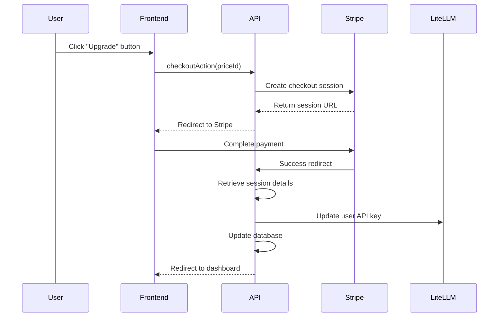

# Payment System Architecture

## Overview

The payment system is built on Stripe's robust subscription management platform, providing automated billing, plan upgrades, and instant API access control. The system integrates deeply with the LiteLLM proxy to provide immediate access to premium models upon subscription activation.

## System Architecture

### Core Components

1. **Stripe Integration Layer** (`/lib/payments/`)
   - Subscription management
   - Webhook processing
   - Customer portal integration

2. **Database Layer** (`/lib/db/schema.ts`)
   - User subscription tracking
   - Stripe entity relationships
   - Activity logging

3. **LiteLLM Integration** (`/lib/litellm/`)
   - API key management
   - Plan-based access control
   - Real-time permission updates

4. **API Routes** (`/app/api/stripe/`)
   - Checkout handling
   - Webhook endpoints
   - User subscription queries

## Subscription Plans

### Plan Structure

```typescript
Free Plan:
  - Price: $0/month
  - Models: ["free"]
  - Rate Limits: 20 RPM, 20,000 TPM
  - Features: Basic AI models, limited usage

Plus Plan:
  - Price: $10/month
  - Models: ["plus", "free"]
  - Rate Limits: 100 RPM, 100,000 TPM
  - Features: Premium models, higher limits

Pro Plan:
  - Price: $50/month
  - Models: ["pro", "plus", "free"]
  - Rate Limits: 500 RPM, 500,000 TPM
  - Features: All models, highest limits
```

### Plan Benefits

- **Hierarchical Access**: Higher plans include all lower-tier models
- **Immediate Activation**: New permissions applied instantly after payment
- **Rate Limiting**: Per-minute request and token limits enforced by LiteLLM
- **Model Access**: Fine-grained control over which AI models users can access

## Payment Flow

### 1. Checkout Process



#### Implementation Details

**Checkout Action** (`/lib/payments/actions.ts`):
```typescript
export async function checkoutAction(formData: FormData) {
  const user = await getUser();
  const priceId = formData.get('priceId') as string;
  
  const session = await stripe.checkout.sessions.create({
    mode: 'subscription',
    customer_email: user.email,
    client_reference_id: user.id,
    line_items: [{ price: priceId, quantity: 1 }],
    success_url: `${baseUrl}/api/stripe/checkout?session_id={CHECKOUT_SESSION_ID}`,
    cancel_url: `${baseUrl}/pricing`,
    allow_promotion_codes: true,
  });
  
  redirect(session.url!);
}
```

**Success Handler** (`/app/api/stripe/checkout/route.ts`):
```typescript
export async function GET(request: NextRequest) {
  const sessionId = searchParams.get('session_id');
  const session = await stripe.checkout.sessions.retrieve(sessionId);
  
  // Update subscription in database
  await upsertStripeRecord(userId, {
    stripeCustomerId: session.customer as string,
    stripeSubscriptionId: subscription.id,
    stripeProductId: subscription.items.data[0].price.product as string,
    planName: effectivePlan as PlanName,
    subscriptionStatus: subscription.status,
  });
  
  // Update LiteLLM API key immediately
  await updateUserKeyForPlan(userId, effectivePlan as PlanName);
  
  return NextResponse.redirect(`${baseUrl}/settings?upgraded=true`);
}
```

### 2. Webhook Processing

Webhooks ensure the system stays synchronized with Stripe subscription changes.

**Supported Events**:
- `customer.subscription.created`
- `customer.subscription.updated`  
- `customer.subscription.deleted`

**Webhook Handler** (`/app/api/stripe/webhook/route.ts`):
```typescript
export async function POST(request: Request) {
  const sig = headers().get('stripe-signature');
  const body = await request.text();
  
  // Verify webhook signature
  const event = stripe.webhooks.constructEvent(body, sig, webhookSecret);
  
  switch (event.type) {
    case 'customer.subscription.updated':
      await handleSubscriptionChange(event.data.object);
      break;
    case 'customer.subscription.deleted':
      await handleSubscriptionDeletion(event.data.object);
      break;
  }
  
  return new Response('Success', { status: 200 });
}
```

### 3. Customer Portal

Users can manage their subscriptions through Stripe's hosted customer portal.

**Portal Access** (`/lib/payments/actions.ts`):
```typescript
export async function customerPortalAction() {
  const user = await getUser();
  const stripeRecord = await getStripeByUserId(user.id);
  
  const portalSession = await stripe.billingPortal.sessions.create({
    customer: stripeRecord.stripeCustomerId,
    return_url: `${baseUrl}/settings`,
  });
  
  redirect(portalSession.url);
}
```

## Database Schema

### Stripe Table

```sql
CREATE TABLE stripe (
  id SERIAL PRIMARY KEY,
  user_id VARCHAR(255) NOT NULL REFERENCES users(id),
  stripe_customer_id TEXT UNIQUE,
  stripe_subscription_id TEXT UNIQUE,
  stripe_product_id TEXT,
  plan_name VARCHAR(10) DEFAULT 'free',
  subscription_status VARCHAR(20) DEFAULT 'inactive',
  created_at TIMESTAMP DEFAULT NOW(),
  updated_at TIMESTAMP DEFAULT NOW()
);
```

### User Integration

```sql
-- Users table includes LiteLLM virtual key
CREATE TABLE users (
  id VARCHAR(255) PRIMARY KEY, -- Firebase UID
  email VARCHAR(255) UNIQUE NOT NULL,
  litellm_virtual_key TEXT,
  -- other fields...
);
```

## LiteLLM Integration

### Key Management

**Key Creation**:
```typescript
export async function createUserKey(user: User, planName: PlanName = 'free'): Promise<string> {
  const planDetails = plans[planName];
  
  const response = await litellmApi.generateKey({
    user_id: user.id.toString(),
    models: planDetails.models,
    rpm_limit: planDetails.rpm,
    tpm_limit: planDetails.tpm,
  });
  
  await db.update(users)
    .set({ litellmVirtualKey: response.key })
    .where(eq(users.id, user.id));
    
  return response.key;
}
```

**Plan Updates**:
```typescript
export async function updateUserKeyForPlan(userId: string, planName: PlanName): Promise<void> {
  const user = await getUserById(userId);
  const planDetails = plans[planName];
  
  if (user.litellmVirtualKey) {
    await litellmApi.updateKey(user.litellmVirtualKey, {
      models: planDetails.models,
      rpm_limit: planDetails.rpm,
      tpm_limit: planDetails.tpm,
    });
  } else {
    const newKey = await createUserKey(user, planName);
    await db.update(users)
      .set({ litellmVirtualKey: newKey })
      .where(eq(users.id, userId));
  }
}
```

## Security & Error Handling

### Webhook Security

- **Signature Verification**: All webhooks verified using `STRIPE_WEBHOOK_SECRET`
- **Idempotency**: Duplicate webhook events handled gracefully
- **Error Responses**: Proper HTTP status codes for Stripe retry logic

### Payment Security

- **Server-Side Processing**: All payment logic on secure backend
- **User Authentication**: Required for all payment operations
- **Data Validation**: Stripe data validated before database updates

### Error Handling

**Critical Error Logging**:
```typescript
try {
  await updateUserKeyForPlan(userId, newPlanName);
} catch (error) {
  console.error(`CRITICAL: LiteLLM key update failed for user ${userId}:`, error);
  // Continue processing - don't block Stripe flow
}
```

**Graceful Degradation**:
- Failed LiteLLM updates don't block subscription processing
- Missing customer records created during checkout
- Webhook failures logged and trigger Stripe retries

## Monitoring & Analytics

### Payment Events

All payment-related activities are logged in the `activityLogs` table:
- Subscription creations
- Plan upgrades/downgrades
- Payment failures
- Portal access

### Usage Tracking

LiteLLM provides built-in usage tracking:
- Request counting per user
- Token usage monitoring
- Rate limit enforcement
- Cost tracking per model

## API Reference

### Payment Actions

```typescript
// Server Actions
checkoutAction(formData: FormData): Promise<void>
customerPortalAction(): Promise<void>
cancelSignupAction(): Promise<void>
```

### API Endpoints

```http
GET  /api/stripe/user           # Get user subscription data
POST /api/stripe/checkout       # Handle successful checkout
POST /api/stripe/webhook        # Process Stripe webhooks
POST /api/stripe/cancel-signup  # Cancel signup process
```

### Response Formats

**User Subscription Data**:
```json
{
  "subscription": {
    "planName": "plus",
    "subscriptionStatus": "active",
    "stripeCustomerId": "cus_...",
    "stripeSubscriptionId": "sub_..."
  }
}
```

## Testing

### Test Mode Configuration

```env
STRIPE_SECRET_KEY=sk_test_...
STRIPE_WEBHOOK_SECRET=whsec_...
NEXT_PUBLIC_STRIPE_PUBLISHABLE_KEY=pk_test_...
```

### Test Cards

Stripe provides test cards for different scenarios:
- `4242424242424242`: Successful payment
- `4000000000000002`: Card declined
- `4000000000009995`: Insufficient funds

## Deployment Considerations

### Environment Variables

Required environment variables:
```env
STRIPE_SECRET_KEY=sk_live_...
STRIPE_WEBHOOK_SECRET=whsec_...
NEXT_PUBLIC_STRIPE_PUBLISHABLE_KEY=pk_live_...
LITELLM_MASTER_KEY=sk-...
```

### Webhook Configuration

Stripe webhook endpoints must be configured to point to:
- `https://yourdomain.com/api/stripe/webhook`
- Events: `customer.subscription.*`

### Database Migrations

Ensure Drizzle migrations are run before deployment:
```bash
pnpm db:migrate
```

## Troubleshooting

### Common Issues

1. **Webhook Signature Mismatches**
   - Verify `STRIPE_WEBHOOK_SECRET` matches Stripe dashboard
   - Check for trailing whitespace in environment variables

2. **LiteLLM Key Update Failures**
   - Verify `LITELLM_MASTER_KEY` is correct
   - Check LiteLLM proxy connectivity
   - Review network firewall rules

3. **Missing Subscription Data**
   - Webhooks may be delayed
   - Check Stripe dashboard for webhook delivery status
   - Verify database connectivity

### Debugging

Enable detailed logging by setting:
```env
NODE_ENV=development
```

This will provide verbose logging for payment flows and webhook processing.